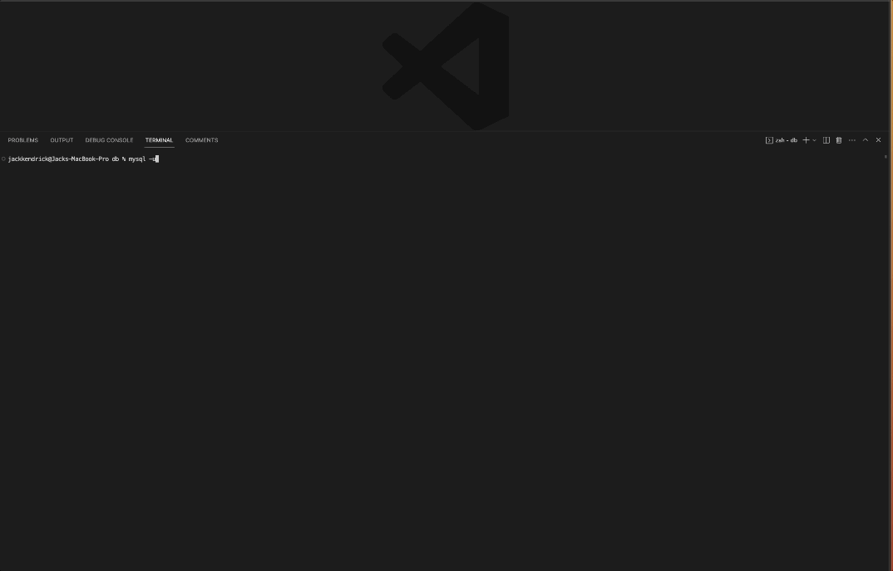
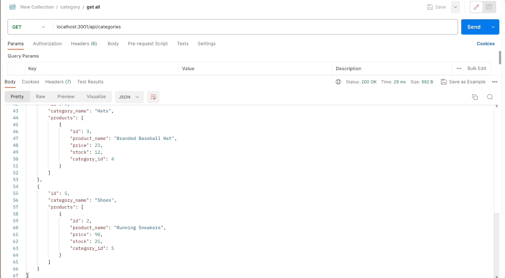
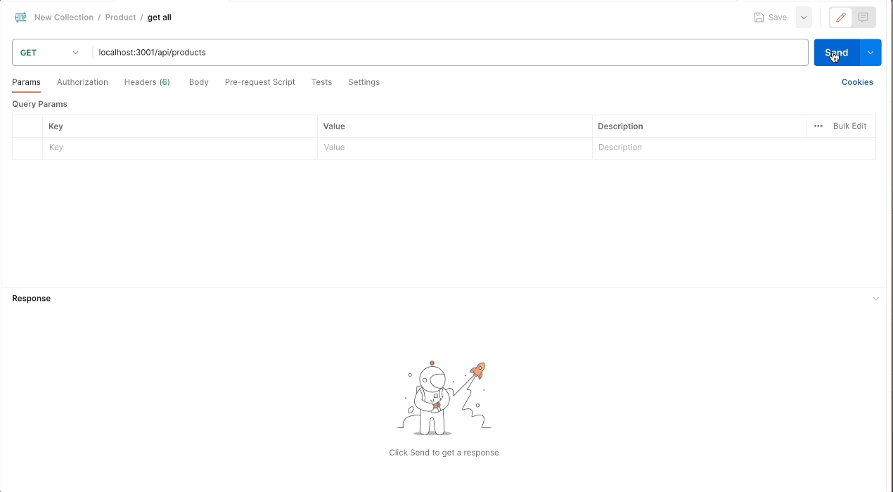

# Shopster

The dominance of e-commerce, also known as internet retail, in the electronics industry is evident through the availability of various platforms catering to businesses of all sizes. Given the widespread usage of these platforms, it is crucial for developers to become familiar with the fundamental architecture of e-commerce sites. Shopster is an application that serves as the backend for an e-commerce site. It is powered by an Express.js API and seamlessly interacts with a MySQL database using Sequelize. The application is specifically designed for testing purposes and can be accessed through Postman. 

## Table of Contents

- [Installation](#installation)
- [Usage](#usage)
- [License](#license)

# Installation

Open the "db folder" in the integrated terminal by right-clicking and selecting "Open Integrated Terminal." Enter mysql -u root -p and provide the password if prompted. Run source schema.sql to initialize the database and tables. Exit the MySQL console by typing quit. Open the integrated terminal by right-clicking on server.js and selecting "Open in Integrated Terminal." Run npm install to install all the required dependencies. The package.json file includes two scripts. To populate the tables with sample data, run npm run seed using the command node seeds/index.js. To start the application, run npm run start or node server.js. Once the application is running, test the provided queries in Postman. Follow these steps to install the application, and then you can interact with it using the specified queries in Postman.

# Usage
The following gifs demonstrate the usage of Postman to test the routes and endpoints.

Github repository link: https://github.com/jackckendrick/shopster
Youtube video shopster tutorial: https://youtu.be/gionnwSqCTU

# License

This project is using the MIT License.

# Badges

